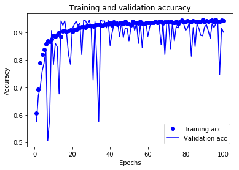

# Lab 9: Scalable neural networks


## Study schedule

- [Section 1](#1-Shallow-neural-networks-in-PySpark): To finish by Wednesday. **Essential**
- [Section 2](#2-Keras-on-PySpark): To finish before the next Monday. **Essential**
- [Section 3](#3-Exercises): To finish before the next Monday. ***Exercise***
- [Section 4](#4-additional-exercises-optional): To explore further. *Optional*

## Introduction

In this notebook we will explore the use of the neural network model that comes implemented in Spark ML. We will also look at Pandas UDFs that allow to efficiently use models trained on a single machine using frameworks different to Spark ML, e.g. TensorFlow, Scikit-learn, and but keeping the benefits of Spark to apply such models to large datasets.  


**Dependencies.** For this lab, we need to install the packages ``pyarrow``, ``matplotlib``, ``pandas``, ``numpy``, ``tensorflow``, ``keras``, ``temp``, and `scikit-learn`. You may have already installed some of these packages before. Make sure you install these packages in the environment **myspark**

Before we continue, open a new terminal and activate the environment

`module load apps/java/jdk1.8.0_102/binary`

`module load apps/python/conda`

`source activate myspark`

You can now use pip to install the packages we need 

`pip install pyarrow pandas numpy tensorflow keras temp scikit-learn`

## 1. Shallow neural networks in PySpark

To illustrate the use of the neural network model that comes in Spark ML, we use the [Spambase Dataset](http://archive.ics.uci.edu/ml/datasets/Spambase) that we already used in Lab 6. 


We need to enable Arrow in Spark. More on this later in the lab.

After initializing the SparkSession, type the following instruction

```python
# Enable Arrow-based columnar data transfers. This line of code will be explained later
spark.conf.set("spark.sql.execution.arrow.pyspark.enabled", "true")
```

The following code is used to load the dataset and properly set the corresponding dataframe.


```python
# We load the dataset and the names of the features
import numpy as np
rawdata = spark.read.csv('../Data/spambase.data')
rawdata.cache()
ncolumns = len(rawdata.columns)
spam_names = [spam_names.rstrip('\n') for spam_names in open('../Data/spambase.data.names')]
number_names = np.shape(spam_names)[0]
for i in range(number_names):
    local = spam_names[i]
    colon_pos = local.find(':')
    spam_names[i] = local[:colon_pos]
    
# We rename the columns in the dataframe with names of the features in spamd.data.names
schemaNames = rawdata.schema.names
spam_names[ncolumns-1] = 'labels'
for i in range(ncolumns):
    rawdata = rawdata.withColumnRenamed(schemaNames[i], spam_names[i])

# We cast the type string to double
from pyspark.sql.types import StringType
from pyspark.sql.functions import col

StringColumns = [x.name for x in rawdata.schema.fields if x.dataType == StringType()]
for c in StringColumns:
    rawdata = rawdata.withColumn(c, col(c).cast("double"))
```

We now create the training and test sets.


```python
trainingData, testData = rawdata.randomSplit([0.7, 0.3], 42)
```

We create instances for the vector assembler and the neural network. 


```python
from pyspark.ml.feature import VectorAssembler
vecAssembler = VectorAssembler(inputCols = spam_names[0:ncolumns-1], outputCol = 'features')
```

The class that implements the neural network model is called the [MultilayerPerceptronClassifier](http://spark.apache.org/docs/3.0.1/api/python/pyspark.ml.html#pyspark.ml.classification.MultilayerPerceptronClassifier) The multilayer perceptron implemented in Spark ML only allows for sigmoidal activation functions in the intermediate layers and the softmax function in the output layer. We can then use the model for binary and multi-class classification. 

The architecture of the network is specified through the argument ``layers`` which is a list. The length of the list is equivalent to the number of hidden layers plus two additional numbers that indicate the number of inputs and the number of outputs. The number of inputs is the first element of the list and the number of outputs is the last element of the list.

For example, if ``layers=[10, 5, 4, 3]``, then this neural network assumes a first layer of 10 nodes (the features), followed by two hidden layers of 5 and 4 nodes and a last layer of 3 outputs (classes).


```python
from pyspark.ml.classification import MultilayerPerceptronClassifier
# The first element HAS to be equal to the number of input features
layers = [len(trainingData.columns)-1, 20, 5, 2] 
mpc = MultilayerPerceptronClassifier(labelCol="labels", featuresCol="features", maxIter=100, layers=layers, seed=1500)
```

We now create the pipeline, fit it to data and compute the performance over the test set


```python
# Create the pipeline
from pyspark.ml import Pipeline
stages = [vecAssembler, mpc]
pipeline = Pipeline(stages=stages)
pipelineModel = pipeline.fit(trainingData)

# We now make predictions
predictions = pipelineModel.transform(testData)
from pyspark.ml.evaluation import MulticlassClassificationEvaluator
evaluator = MulticlassClassificationEvaluator\
      (labelCol="labels", predictionCol="prediction", metricName="accuracy")
accuracy = evaluator.evaluate(predictions)
print("Accuracy = %g " % accuracy)
```

    Accuracy = 0.809596 


## 2. Keras on PySpark

The alternatives for neural networks in Spark ML are rather limited. We can only do classification through the class MultilayerPerceptronClassifier and even for this model there are important restrictions, e.g. it can only use logistic sigmoid activation functions. 

It is possible to use more advaced neural network models, including deep learning models, in PySpark. A way to do it is to make use of a very powerful API in Spark SQL known as **pandas user defined functions** or [**pandas UDFs**](http://spark.apache.org/docs/3.0.1/sql-pyspark-pandas-with-arrow.html#pandas-udfs-aka-vectorized-udfs) for short (they are also known as vectorized UDFs) or equivalently through different [**pandas functions APIs**](http://spark.apache.org/docs/3.0.1/sql-pyspark-pandas-with-arrow.html#pandas-function-apis), like **mapInPandas()**. PySpark uses [Apache Arrow](https://en.wikipedia.org/wiki/Apache_Arrow) to efficiently transfer data between the JVM (Java Virtual Machine) and Python processes, allowing the efficient use of pandas for data analytic jobs in the cluster. A comprehensive user guide of Pandas with Arrow can be found [here](http://spark.apache.org/docs/3.0.1/sql-pyspark-pandas-with-arrow.html)

A typical use case for pandas UDFs or pandas functions APIs in scalable machine learning consists on training a machine learning model on a single machine using a subset of the data and then using that model to provide predictions at scale by distributing the trained model to the executors, which later compute the predictions. 

In this section of the Lab, we will train a Keras model using a subset of the spambase dataset and then we will use [mapInPandas()](http://spark.apache.org/docs/3.0.1/api/python/pyspark.sql.html#pyspark.sql.DataFrame.mapInPandas) to ask the executors to compute the predictions over the test set. 

#### Using keras to train a neural network model over the Spambase dataset

We want to use the same training data that we used in Section 1 of the lab. However, we first need to transform the spark dataframe into a pandas dataframe. 

If you go back to the beginning of the lab, we used the instruction

`spark.conf.set("spark.sql.execution.arrow.pyspark.enabled", "true")`

This instruction enabled Arrow so that the transformation between spark dataframes and pandas dataframes can be done efficiently.


```python
# Convert the Spark DataFrame to a Pandas DataFrame using Arrow
trainingDataPandas = trainingData.select("*").toPandas()
```

We prepare the data for keras


```python
nfeatures = ncolumns-1
Xtrain = trainingDataPandas.iloc[:, 0:nfeatures]
ytrain = trainingDataPandas.iloc[:, -1]
```

We configure the neural network model

*Note.* If you are running on HPC, you may get several warnings when working with this installation of TensorFlow. The warnings are related to a non-proper configuration of TensorFlow to work with GPUs. You can safely ignore those for this lab.


```python
from keras import models
from keras import layers

model = models.Sequential()
model.add(layers.Dense(20, activation='relu', input_shape=(np.shape(Xtrain)[1],)))
model.add(layers.Dense(5, activation='relu'))
model.add(layers.Dense(1, activation='sigmoid'))
```

We now compile the model


```python
model.compile(optimizer='rmsprop', loss='binary_crossentropy', metrics=['accuracy'])
```

Fit the model to data using 20% of the training data for validation


```python
history = model.fit(Xtrain, ytrain, epochs=100, batch_size=100, validation_split=0.2, verbose=False)
```

Let us plot the progress of the training


```python
import matplotlib.pyplot as plt

history_dict = history.history
acc_values= history_dict['accuracy']
val_acc_values= history_dict['val_accuracy']
epochs = range(1, len(acc_values)+1)

plt.plot(epochs, acc_values, 'bo', label='Training acc')
plt.plot(epochs, val_acc_values, 'b', label='Validation acc')
plt.title('Training and validation accuracy')
plt.xlabel('Epochs')
plt.ylabel('Accuracy')
plt.legend()
plt.savefig("../Output/keras_nn_train_validation_history.png")
```




We will now use mapInPandas to distribute the computation efficiently. For being able to broadcast the trained model to the executors, the model needs to be picklable, this is, it is required that the model can be serialized by the [pickle module](https://docs.python.org/3/library/pickle.html). Unfortunately, Keras does not support pickle to serialize its objects (models). Zach Moshe proposed a [patch to serialize Keras models](http://zachmoshe.com/2017/04/03/pickling-keras-models.html) that was further elaborated in [this StackOverFlow entry](https://stackoverflow.com/questions/61096573/using-tensorflow-keras-model-in-pyspark-udf-generates-a-pickle-error). We use the `ModelWrapperPickable` class suggested in the StackOverFlow entry.


```python
import tempfile
import tensorflow
import pandas as pd

class ModelWrapperPickable:

    def __init__(self, model):
        self.model = model

    def __getstate__(self):
        model_str = ''
        with tempfile.NamedTemporaryFile(suffix='.hdf5', delete=True) as fd:
            tensorflow.keras.models.save_model(self.model, fd.name, overwrite=True)
            model_str = fd.read()
        d = { 'model_str': model_str }
        return d

    def __setstate__(self, state):
        with tempfile.NamedTemporaryFile(suffix='.hdf5', delete=True) as fd:
            fd.write(state['model_str'])
            fd.flush()
            self.model = tensorflow.keras.models.load_model(fd.name)
```

We now create a model using the `ModelWrapperPickable` class


```python
model_wrapper = ModelWrapperPickable(model)
```

The mapInPandas() function that we use here will return a dataframe that has the same column features of `testData` and an additional column for the predictions. We first create a schema containing this structure. Before creating the schema, though, we extract from `testData` a dataframe that only contains the features.


```python
Xtest = testData.select(spam_names[0:ncolumns-1])
```

Now, the new schema for the output dataframes


```python
from pyspark.sql.types import StructField, StructType, DoubleType
pred_field = [StructField("prediction", DoubleType(), True)] 
new_schema = StructType(Xtest.schema.fields + pred_field)
```

We create a `predict` method which will be applied by the executors to compute the predictions. What this routine does is to iterate over batches of dataframes, using the model_wrapper to compute the predictions, and return the corresponding batches of dataframes with the additional prediction column.  


```python
def predict(iterator):
    for features in iterator:
        yield pd.concat([features, pd.Series(model_wrapper.model.predict(features).flatten(), name="prediction")], axis=1)
```

We now apply predict to batches of the `Xtest` dataframe using mapInPandas


```python
prediction_keras_df = Xtest.mapInPandas(predict, new_schema)
```

The resulting dataframe is a spark dataframe. We select the column of predictions and transform it to pandas to later compute the accuracy on the test data. 


```python
ypred_keras = prediction_keras_df.select('prediction').toPandas().values
```

We use a threshold of 0.5 to assign the predictions to class 0 and class 1


```python
ypred_keras[ypred_keras <0.5] = 0
ypred_keras[ypred_keras >0.5] = 1
```

We now extract the target test data from the `testData` dataframe


```python
testDataPandas = testData.select("*").toPandas()
ytest = testDataPandas.iloc[:, -1].values
```

We finally use the accuracy_score method from scikit-learn to compute the accuracy


```python
from sklearn.metrics import accuracy_score
print("Accuracy = %g " % accuracy_score(ypred_keras, ytest))
```

    Accuracy = 0.922315 


The accuracy obtained by the keras model is different than the one obtained using the neural network model in Spark ML 
even though they are using the same training data. Why is that?

## 3. Exercises

**Note**: A *reference* solution will be provided in Blackboard for this part by the following Wednesday (the latest).

### Exercise 1

Include a cross-validation step for the pipeline of the neural network applied to the spambase dataset in [section 1](#1-Shallow-neural-networks-in-PySpark). An example of a cross-validator can be found [here](http://spark.apache.org/docs/3.0.1/ml-tuning.html#cross-validation). Make <tt>paramGrid</tt> contains different values for the parameter ``layers`` and find the best parameters and associated accuracy on the test data.

### Exercise 2

Repeat [section 2](#2-Keras-on-PySpark) of this Lab but now experiment with a Scikit-learn model. Choose [a classifier from the ones available](https://scikit-learn.org/stable/supervised_learning.html#supervised-learning), train the classifier over the same training data and use pandas and arrow to send the model to the executors, which will provide the predictions. Do you need to use the class `ModelWrapperPickable`?


## 4. Additional exercise (optional)

**Note**: NO solutions will be provided for this part.

Repeat [section 2](#2-Keras-on-PySpark) using a PyTorch model.
